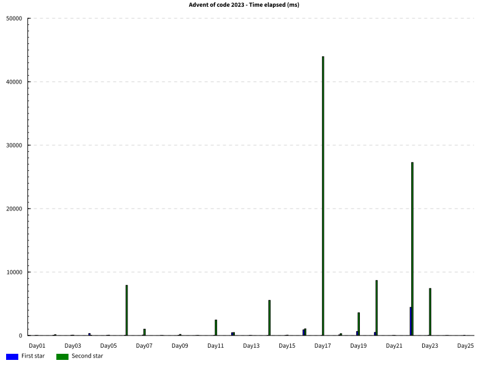

My advent of code for 2024

Each days are in `src/DayN.hs`.

`src/DayX.hs` is the template to start each day, you can generate a new file using `src/startDay X`.

Starts a nix shell with `nix develop` (or use direnv).

`ghci` starts a repl, you can load your day with `:l DayXY`.

`Utils`, `Path`, `Direction` contains a shitload of utils, that I don't remember.

# Benchmarks / Testing

You can run a global test using `nix run .#benchmark`, it gives the individual
test time as well as global timing. It uses `sydtest` underneath, so you can
use filtering (for performant execution of individual tests) or other nice
features.

For example:

- `nix run .#bench  -- -f "works"` gives the timing only of the "star"
  problem, not examples.
- `nix run .#bench  -- -f "Day 04"` focuses on `Day 04`.

I'm targeting to run all problems in less than 1s.

- `nix run .#bench` also updates the `bench.json` and `bench.svg` files which
  contains a summary of timings as well as a bar plot. Note that if you run it
  with altered option, it may break these files.

# Tests

You can run the tests for one day in ghci using `:load tests/DayXXSpec.hs` and then `>>> sydTest spec`.

You can run all tests in ghci using `:load tests/Bench.hs` and then `>>> :main`.
